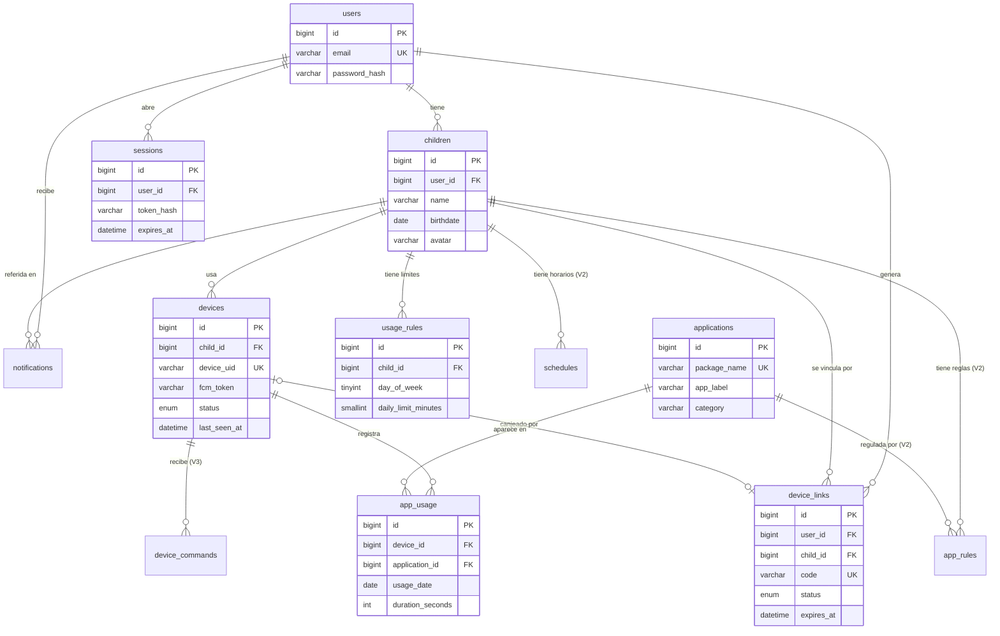

# MIKORI — Modelo de datos (ERD)

Diagrama entidad-relación del esquema definido en [`schema.sql`](./schema.sql).

## Cardinalidades clave
- Un **padre** tiene varios **hijos**.
- Un **hijo** puede tener uno o varios **dispositivos**.
- Un **dispositivo** acumula historial en **app_usage**.
- Un **hijo** tiene **límites diarios** (`usage_rules`), y en V2 reglas por app y horarios.

## Notas de versión
- **V1** usa: `users`, `children`, `devices`, `device_links`, `applications`, `app_usage`, `usage_rules`, `sessions`.
- **V2/V3** usan: `app_rules`, `schedules`, `device_commands`, `notifications` (creadas desde ya).
